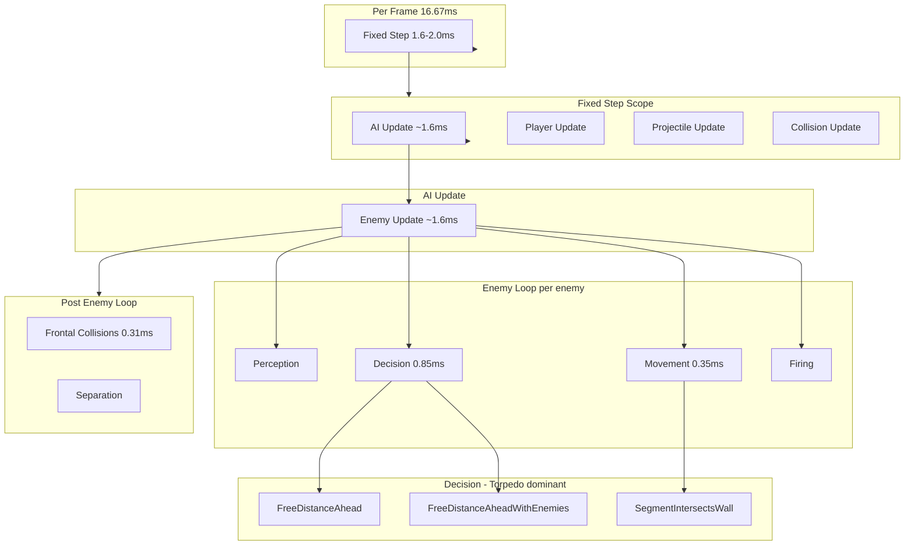

# Bolt Game Performance Optimization Strategy

**Final plan (merged analysis)**  
**Generated:** 2025-03-03  
**Budget:** 16.667ms @ 60 FPS  
**Profile summary:** frame.total avg 16.8–17.4ms (101–105% budget), spikes to 280ms; fixed_step avg 1.5–2.0ms; ~63 active enemies.

This document consolidates two independent analyses and serves as the canonical optimization strategy.

### Phase 1 Implementation (2025-03-03)

| Task | Status | Notes |
|------|--------|-------|
| 1.1 Unify geometry | Done | `FreeDistanceAhead`, `FreeDistanceAheadWithEnemies`, `IsSegmentObscuredByWall` moved to `game::geometry::WorldGeometry` |
| 1.2 Coarser ray sampling | Done | `kRaySampleSpacing` 0.08 → 0.12 in `WorldGeometry.cpp` |
| 1.3 Pre-filter in FreeDistanceAheadWithEnemies | Done | Candidates within `probeDistance + separationRadius` of `from`; uses `DistanceSq` in inner loop |
| 1.4 Pathfinding alloc pool | Done | `PathfindingPool` with reused `occupied`, `nodes`, `openHeap`, `pathCells`; manual heap instead of `priority_queue` |
| 1.5 Distance vs DistanceSq | Done | `BuildAssassinPathToFarRandomTarget`, `TrySeparationTurn`, `ResolveEnemySeparation`, overlap check in movement loop |

### Phase 2 Implementation (2025-03-03)

| Task | Status | Notes |
|------|--------|-------|
| 2.1 Grid broad phase | Done | `game::spatial::EnemySpatialGrid`; `ResolveEnemyFrontalCollisions` uses `BuildFromSegments` + `ForEachPairInSameOrAdjacentCell` |
| 2.2 Grid for separation | Done | `ResolveEnemySeparation` uses `BuildFromPositions` + same pair iteration; shared grid instance |
| 2.3 Cell index for FreeDistanceAheadWithEnemies | Done | Optional `spatialGrid` param; when provided, uses `GetEnemiesAlongRay`; grid built once per frame from frame-start positions |

### Phase 3 Implementation (2025-03-03)

| Task | Status | Notes |
|------|--------|-------|
| 3.1 Repath throttling | Pending | |
| 3.2 Adaptive ray sampling | Done | `AdaptiveStepAt`; finer 0.08 near origin, coarser 0.20 far; applied to `FreeDistanceAhead`, `FreeDistanceAheadWithEnemies`, `IsSegmentObscuredByWall` |
| 3.3 Occupancy incremental update | Pending | |

---

## 0. Performance and Optimization Ideas (Concepts)

### Why frame time matters

At 60 FPS, each frame has **16.667 ms** total. The game loop does: input → AI → physics → render. If any part exceeds its share, frames drop. Profile shows fixed_step (simulation) at ~1.6 ms and frame.total at ~17 ms — most time is elsewhere (render, vsync, platform), but simulation is still ~10% and should stay predictable to avoid occasional hitches.

### Hot spots and Amdahl's Law

**Amdahl's Law:** Speedup is limited by the fraction of work that is optimized. If 50% of time is in raycasts, optimizing raycasts by 2× gives at most ~25% total speedup. The profile shows:

- **enemy.ai.decision + torpedo + movement:** ~12–15% combined — largest single opportunity
- **frontal_collisions + separation:** ~4% — O(n²) with n=63 → spatial hashing is high leverage

### O(n) vs O(n²) and why it matters

With 63 enemies:

- **O(n)** work: 63 operations
- **O(n²)** work: 63 × 62 / 2 ≈ 2000 pairwise checks

`ResolveEnemyFrontalCollisions` and `ResolveEnemySeparation` do all-pairs. **Spatial hashing** groups enemies into cells; you only check pairs in the same or neighboring cells. Average neighbors per cell ≈ k (e.g. 5–10), so cost drops to O(n × k) instead of O(n²).

### Raycasting cost and sampling

`FreeDistanceAhead` samples every 0.12 units along a ray (Phase 1.2). For 6 units: 6/0.12 ≈ 50 samples. Each sample: cell lookup + wall check. Torpedo AI may call this many times per frame with `FreeDistanceAheadWithEnemies`, which adds an inner loop over all 63 enemies. Reducing samples (e.g. 0.12 → ~50) or filtering enemies before the inner loop cuts work proportionally.

### DistanceSq vs Distance

`sqrt` is relatively expensive. For comparisons (e.g. "is distance &lt; r?"), use `distanceSq < r*r` and avoid `sqrt`. The code already uses `DistanceSq` in collision checks; audit hot paths for any remaining `Distance()` where only comparison is needed.

### Allocation in the hot path

Dynamic allocation (malloc, `std::vector::push_back` without reserve, etc.) can cause pauses and fragmentation. [ARCHITECTURE.md](ARCHITECTURE.md) forbids allocation in the update loop. Pathfinding allocates `std::vector` per call — **object pooling** reuses buffers across frames to avoid this.

### Single-thread first, then threading

Threading adds complexity (synchronization, cache coherency, debugging). Single-thread optimizations are simpler, work on all platforms (including RG353V), and often give most of the benefit. Defer threading until single-thread work is done and budget is still tight.

### Data-oriented design

Keeping related data contiguous (e.g. all positions in one array) improves cache use. The current AoS (array of structs) for enemies is fine at n=63; SoA becomes relevant at much larger entity counts.

---

## 1. Calculation Type Classification

| Category | Examples | Current Complexity | Profile Impact | Notes |
|----------|-----------|--------------------|----------------|-------|
| **Ray / clearance queries** | `FreeDistanceAhead`, `FreeDistanceAheadWithEnemies` | O(steps) per ray; `WithEnemies` adds O(steps × candidates) | 5–12% (via torpedo, decision, hunter) | `kRaySampleSpacing=0.12`; pre-filter limits candidates |
| **Point-in-cell queries** | `IsPointInWall`, `HitsWallAtPoint` | O(1) per point | Indirect (inside rays/segments) | Duplicated in EnemySystem, SpawnerSystem, CollisionSystem |
| **Segment–segment distance** | `SegmentToSegmentDistance` | O(1) per pair | ~2% (frontal collisions) | Called for all pairs in `ResolveEnemyFrontalCollisions` |
| **Pairwise separation** | `ResolveEnemySeparation` | O(n²) | ~2% | All-pairs distance + `IsPointInWall` for moved positions |
| **A* pathfinding** | `BuildAssassinPath` | O(cells × log cells) | ~0.6–0.9% (assassin type) | Uses `std::vector`, `std::priority_queue`, per-call alloc |
| **Occupancy building** | `BuildEnemyOccupancy` | O(n) per assassin | Inside pathfinding | Per-assassin, full grid reset |
| **LOS checks** | `IsSegmentObscuredByWall` | O(steps) per segment | Indirect (perception) | Similar sampling to `FreeDistanceAhead` |
| **Spawn evaluation** | `PickSpawnDirection`, `IsSpawnPositionFree` | O(8 × steps) + O(n) per base | Low | SpawnerSystem; duplicated geometry |

---

## 2. Industry Best Practices by Type

### Ray / clearance queries
- **Reduce sample density:** Use adaptive step size (e.g., coarser far from origin; finer near obstacles).
- **Early exit:** Stop as soon as wall/obstacle hit; already done; consider distance-based coarsening for far samples.
- **Spatial acceleration:** Exclude enemies outside a distance/angle cone before inner loop.
- **Batch / cache:** Reuse clearance along same heading when heading unchanged (torpedo MOVE optimization partially does this; extend to other types).
- **Hierarchical representation:** Precompute cell-to-cell clearance or navmesh for common paths.

### Point-in-cell (wall checks)
- **Single implementation:** Consolidate `IsPointInWall` / `HitsWallAtPoint` / `IsInsideMaze` into one module used by all systems.
- **Cache locality:** Keep maze data linear; avoid scattered lookups; consider wall-edge representation for DDA-style ray marching.
- **SIMD / batch:** If many points checked at once, consider vectorized cell lookups (optional, lower priority).

### Pairwise collision / separation (O(n²))
- **Spatial hashing:** Use grid cells or spatial hash; only check pairs in same or adjacent cells. With ~63 enemies in 60×60 maze, most pairs can be culled.
- **Broad phase / narrow phase:** Broad phase with grid/cells; narrow phase only for nearby pairs.
- **Cell-based bucketing:** Assign each enemy to a cell; iterate cell neighbors only.
- **BVH / sweep:** For segment tests, sweep-and-prune or BVH possible but grid usually simpler for this scale.

### Pathfinding (A*)
- **Object pooling:** Reuse `std::vector` / `priority_queue` buffers; avoid per-frame alloc/dealloc.
- **Hierarchical A*:** Coarse graph (e.g., room/corridor) then refine locally.
- **Repath throttling:** Limit repath frequency per assassin; reuse path when still valid.
- **Off-main-thread:** Precompute routes on worker thread per ARCHITECTURE.md TODO; main thread uses cached result when ready.

### Occupancy / spatial queries
- **Persistent grid:** Maintain occupancy grid; update incrementally when enemies move instead of full rebuild.
- **Spatial index:** If many entities, use grid or quadtree for fast neighborhood queries.

### Geometry / LOS duplication
- **Shared geometry module:** Single source for `IsPointInWall`, `FreeDistanceAhead`, segment-vs-wall, etc.; call from EnemySystem, SpawnerSystem, CollisionSystem.
- **Consistent sampling:** Use same `sampleSpacing` / rules everywhere to avoid subtle behavior differences.

---

## 3. Prioritized Optimization Strategy

### Phase 1 — Quick wins (target ~2–4% budget reduction)

| Task | Files | Action | Rationale |
|------|-------|--------|-----------|
| **1.1** Unify geometry | New `core/Geometry.h` (or `game/geometry/`), EnemySystem, SpawnerSystem, CollisionSystem | Extract `IsPointInWall`, `FreeDistanceAhead`, segment-vs-wall into shared module; remove duplicates | Reduces duplication, enables single point for tuning (e.g., sample spacing) |
| **1.2** Coarser ray sampling | Geometry module | Increase `sampleSpacing` from `0.08` to `0.12`–`0.16` for clearance probes; validate gameplay | ~75 steps → ~38–50 per 6-unit ray; less work in `FreeDistanceAhead` / `FreeDistanceAheadWithEnemies` |
| **1.3** Early-exit in `FreeDistanceAheadWithEnemies` | Geometry module | Before inner enemy loop, filter to enemies within `probeDistance + separationRadius`; skip distant enemies | Cuts inner loop size for torpedo-heavy scenes |
| **1.4** Pathfinding alloc reuse | EnemySystem.cpp | Pool buffers for pathfinding; reuse across calls | Removes hot-path allocation |
| **1.5** Audit Distance vs DistanceSq | EnemySystem, CollisionSystem, SpawnerSystem | Replace Distance() with DistanceSq() where only comparison needed | Avoids sqrt in hot paths |

### Phase 2 — Spatial acceleration (target ~3–5% budget reduction)

| Task | Files | Action | Rationale |
|------|-------|--------|-----------|
| **2.1** Grid-based broad phase | CollisionSystem or new PhysicsSpatial module | Assign enemies to grid cells (e.g., 6×6 unit cells). `ResolveEnemyFrontalCollisions` and `ResolveEnemySeparation` only check pairs in same/adjacent cells | O(n²) → O(n × k) where k = avg neighbors per cell; large gain at ~63 enemies |
| **2.2** Separation cell bucketing | EnemySystem | Reuse same grid for separation; iterate cell + neighbors only | Same acceleration pattern as 2.1 |
| **2.3** `FreeDistanceAheadWithEnemies` spatial filter | Geometry module | Build per-frame cell index of alive enemies; only test enemies in cells along ray | Replaces full O(n) enemy loop with O(cells_along_ray × avg_per_cell) |

### Phase 3 — Algorithmic and structural (target ~2–3% budget reduction)

| Task | Files | Action | Rationale |
|------|-------|--------|-----------|
| **3.1** Repath throttling | EnemySystem | Limit assassin repath to once per N seconds or when path invalidated; reuse cached path otherwise | Reduces A* call count |
| **3.2** Adaptive ray sampling | WorldGeometry.cpp | Done. `AdaptiveStepAt`; finer 0.08 near origin, coarser 0.20 far; applied to `FreeDistanceAhead`, `FreeDistanceAheadWithEnemies`, `IsSegmentObscuredByWall` | Fewer samples for long rays when obstacle far |
| **3.3** Occupancy incremental update | EnemySystem | Maintain `occupied[]` grid; on enemy move, flip old/new cell bits; avoid full `BuildEnemyOccupancy` each pathfind | O(n) full clear → O(1) per move when pathfinding |

### Phase 4 — Threading (per ARCHITECTURE.md TODO)

| Task | Files | Action | Rationale |
|------|-------|--------|-----------|
| **4.1** Pathfinding worker | EnemySystem, threading | Run `BuildAssassinPath` (and far-target selection) on worker; main thread uses last valid path until new one ready | Offloads A*; reduces fixed-step spikes |
| **4.2** Spawn evaluation worker | SpawnerSystem | Offload `PickSpawnDirection` / candidate eval to worker when bases near spawn | Low volume but aligns with TODO |

### Phase 5 — Render/overhead (if frame.total still over budget)

| Task | Files | Action | Rationale |
|------|-------|--------|-----------|
| **5.1** Profiling overhead | Profiling.cpp | Consider sampling (e.g., profile 1 in N frames) or fewer scopes in ship builds | Reduces profiling cost |
| **5.2** Render culling | Renderer2D | Verify maze cell culling and entity culling; minimize draws | Already noted in GAME_DESIGN; audit if OH (overhead) high |
| **5.3** Move debug overlay to HUD area | GameApp, DebugOverlayRenderer | Place perf/debug text over HUD band instead of gameplay field | Improves visual readability; avoids overlap with world action |
| **5.4** HUD render caching | Renderer2D, GameApp | Cache static HUD layer in memory; refresh heavy HUD parts every 10 frames while keeping critical counters real-time | Reduces repeated per-frame draw overhead |

---

## 4. Implementation Order Summary

```
Phase 1 (1–2 days)
├── 1.1 Unify geometry (IsPointInWall, FreeDistanceAhead)
├── 1.2 Coarser ray sampling (0.08 → 0.12–0.16)
├── 1.3 Spatial pre-filter for FreeDistanceAheadWithEnemies
├── 1.4 Pathfinding alloc pool
└── 1.5 Audit Distance vs DistanceSq

Phase 2 (2–3 days)
├── 2.1 Grid broad phase for ResolveEnemyFrontalCollisions
├── 2.2 Grid for ResolveEnemySeparation
└── 2.3 Cell index for FreeDistanceAheadWithEnemies enemy loop

Phase 3 (1–2 days)
├── 3.1 Assassin repath throttling
├── 3.2 Adaptive ray sampling
└── 3.3 Incremental occupancy (if Assassin count high)

Phase 4 (optional, 2+ days)
├── 4.1 Pathfinding worker thread
└── 4.2 Spawn eval worker (low priority)
```

---

## 5. Comparison with Prior Analysis

**ARCHITECTURE.md TODO (Cross-Platform Multithreading)** suggests:
- Pathfinding precompute / route scoring
- Visibility / LOS grid precompute
- Spawn-point candidate evaluation
- AI utility scoring over immutable world snapshots

**This strategy:**
- **Aligns:** Phases 3.1, 3.3, and 4.1–4.2 directly support pathfinding and spawn evaluation offload; Phase 2’s grid could later feed a visibility precompute.
- **Adds:** Explicit spatial hashing for O(n²) collision/separation (Phase 2), which the TODO does not mention; this is a high-impact, localized change.
- **Adds:** Ray-sampling and geometry consolidation (Phases 1.1–1.3) as foundational optimizations before threading.
- **Adds:** Pathfinding alloc pooling (Phase 1.4) as a prerequisite to safe worker-thread object reuse.

**Different conclusions:**
- Prior focus: threading and precompute. This strategy prioritizes **single-threaded fixes first** (geometry, sampling, spatial hashing, pooling) because they are lower risk, easier to verify on RG353V, and address the largest measured hotspots (torpedo, decision, frontal collisions, separation).
- Threading is deferred to Phase 4 and marked optional, to be applied after Phases 1–3 have brought frame time comfortably under budget.

---

## 6. Validation Checklist

After each phase:
- [ ] Fixed-step avg remains ≤ 16.667ms (ideally &lt; 14ms for headroom)
- [ ] No new allocations in fixed-step loop (Profiling allocation telemetry)
- [ ] Gameplay unchanged (or documented in `GAME_DESIGN.md`)
- [ ] RG353V build tested if available
- [ ] Profile report confirms expected scope reductions

---

## 7. Data Flow (Simulation Hot Path)



---

## 8. Final Plan Summary (Merged Analyses)

This strategy merges two independent model analyses. Key decisions:

| Decision | Rationale |
|----------|-----------|
| **Phase 1.3 (pre-filter)** in quick wins | Distance-filter before enemy loop in `FreeDistanceAheadWithEnemies` is low-risk and high-impact for torpedo-heavy scenes |
| **Phase 3.3 (incremental occupancy)** | Avoid full `BuildEnemyOccupancy` reset each pathfind; flip bits on enemy move |
| **Phase 3.2 (adaptive ray sampling)** | Finer near origin, coarser far; or binary-search probe for long rays |
| **Phase 5 (render/overhead)** | Profiling sampling and render audit if budget still exceeded |
| **Threading deferred to Phase 4** | Single-thread fixes first; threading optional after Phases 1–3 |
| **Validation checklist** | Per-phase verification to avoid regressions |

Expected gains: Phase 1 (~2–4%), Phase 2 (~3–5%), Phase 3 (~2–3%) → total ~7–12% budget reduction, bringing fixed_step comfortably under 16.667ms with headroom for spikes.
